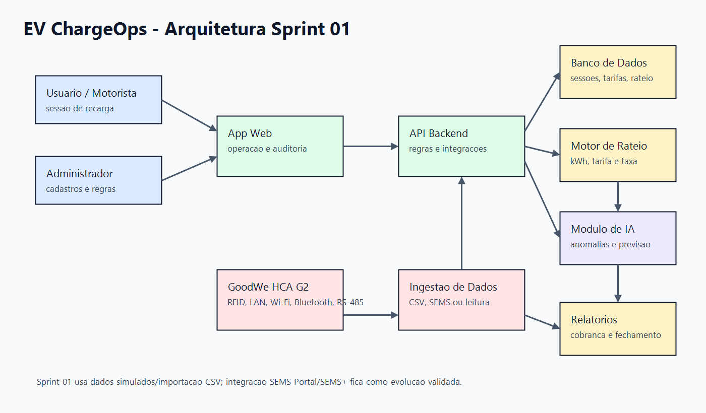

# EV ChargeOps

Equipe: Pedro Henrique Canavezi - RM 570298

Este repositorio documenta a Sprint 01 do EV ChargeOps, uma proposta para controlar sessoes de recarga de veiculos eletricos em locais compartilhados. O recorte usado no trabalho e o desafio GoodWe, considerando o carregador HCA G2 como equipamento de referencia.

A ideia ainda nao e criar o sistema completo. Nesta sprint eu organizei o problema, as pesquisas, as decisoes tecnicas iniciais e um caminho realista para a Sprint 02.

## Problema e contexto

O problema principal nao e apenas instalar um carregador. Em um condominio, estacionamento, campus ou frota pequena, alguem precisa responder perguntas bem praticas:

- quem usou o carregador;
- quanto foi consumido em kWh;
- qual tarifa deve ser usada;
- como dividir esse custo;
- como explicar a cobranca se alguem questionar.

Se isso for feito so por planilha ou leitura manual, o fechamento mensal fica fragil. Pode haver erro de digitacao, sessao sem identificacao, tarifa aplicada de forma diferente e pouca rastreabilidade. Por isso o EV ChargeOps foi pensado como uma camada de controle: registrar sessoes, calcular o rateio e deixar uma memoria de calculo auditavel.

## Relacao com o desafio GoodWe

Para manter o projeto ligado ao enunciado, a camada fisica considerada e o carregador GoodWe HCA G2. Pelos materiais publicos consultados, o HCA G2 trabalha com identificacao por RFID e conectividade por LAN, Wi-Fi, Bluetooth e RS-485. A GoodWe tambem cita integracao com SEMS+/SEMS Portal.

Mesmo assim, eu nao tratei a integracao GoodWe como pronta. Nesta etapa nao ha acesso a uma API, conta de testes, equipamento fisico ou documentacao privada. Por isso a decisao tecnica da Sprint 01 foi:

- usar CSV e dados simulados para representar sessoes de recarga;
- modelar os campos que provavelmente seriam necessarios em uma integracao real;
- deixar SEMS+/SEMS Portal, exportacao da plataforma ou leitura local via RS-485 como evolucao futura;
- nao inventar endpoint, token, payload ou regra que nao esteja comprovada.

Essa escolha reduz risco na Sprint 02. Antes de automatizar a coleta, o projeto precisa provar que sabe calcular e explicar o rateio.

## Objetivo do MVP

O MVP deve provar quatro pontos:

- cadastrar local, carregador, usuario e veiculo;
- importar ou registrar sessoes de recarga;
- calcular o valor por sessao com base em kWh consumido;
- gerar um demonstrativo simples para auditoria.

A prioridade do rateio por kWh vem do fato de que energia consumida e a medida mais direta para justificar custo. Tempo conectado pode entrar como regra complementar, mas sozinho pode cobrar mal uma sessao lenta, interrompida ou com pouca energia entregue.

## Sprint 01 - Frentes de pesquisa

### Frente 1 - Contexto e Problema

Opcao de aprofundamento escolhida: analise de mercado.

Nesta frente, eu comparei os cenarios em que a recarga compartilhada tende a gerar mais atrito: condominios, estacionamentos, campus e frotas leves. O ponto comum entre eles e a necessidade de prestar contas. O administrador quer fechar o mes sem conflito, o motorista quer entender o que pagou e o operador precisa saber se o carregador esta sendo usado direito.

O detalhamento esta em `docs/pesquisa-mercado.md`.

### Frente 2 - Base Regulatoria e Tecnica

Opcao de aprofundamento escolhida: APIs complementares e premissas de integracao.

Aqui eu separei dois assuntos que se misturam bastante: regras de operacao e possibilidade tecnica de integrar com o carregador. Foram levantados pontos da ANEEL, Inmetro, Lei 14.300/2022 e normas tecnicas relacionadas. Do lado GoodWe, a pesquisa ficou limitada ao que aparece publicamente sobre HCA G2, RFID, LAN, Wi-Fi, Bluetooth, RS-485 e SEMS+/SEMS Portal.

O detalhamento esta em `docs/base-regulatoria.md`.

### Frente 3 - Arquitetura e IA

Opcao de aprofundamento escolhida: esquema da base de dados.

Nesta frente eu desenhei uma arquitetura inicial com app web, API backend, banco de dados, modulo de ingestao, motor de rateio, relatorios e modulo de IA. Tambem defini um modelo de dados inicial com Local, Carregador, Usuario, Veiculo, SessaoRecarga, Tarifa, Rateio e Auditoria.

A IA aparece como apoio, nao como decisor. Ela pode sinalizar anomalias e explicar uma cobranca, mas nao deve alterar valores financeiros sozinha. Em cobranca, o resultado precisa ser conferivel por regra, tarifa e medicao.

O detalhamento esta em `docs/arquitetura.md` e `docs/papel-ia.md`.

## Diagrama de arquitetura



O mesmo desenho tambem aparece em Mermaid em `docs/arquitetura.md`, porque e mais facil ajustar o fluxo durante a Sprint 02.

## Modelo de rateio

A formula inicial e propositalmente simples:

```text
valor_energia = kwh_consumido * tarifa_kwh
valor_taxa = taxa_fixa_sessao + (valor_energia * percentual_operacional)
valor_total = valor_energia + valor_taxa - desconto
```

O kWh fica como base porque e o dado mais ligado ao custo de energia. A taxa operacional existe para cobrir itens que a tarifa pura nao cobre, como manutencao, administracao e infraestrutura. As regras, exemplos e pendencias estao em `docs/modelo-rateio.md`.

## Papel da IA

A IA deve ajudar o administrador a enxergar problemas, nao substituir a regra de cobranca. Os primeiros usos fazem mais sentido em:

- detectar sessao com dado incompleto;
- apontar consumo fora do padrao;
- resumir fechamento mensal;
- explicar a memoria de calculo em linguagem simples;
- sugerir pontos de manutencao ou investigacao.

Ela nao deve inventar leitura de medidor nem aprovar desconto, taxa ou cobranca automaticamente. Esses pontos precisam ficar sob controle humano porque impactam dinheiro e podem gerar contestacao.

## Plano para Sprint 02

Na Sprint 02, o caminho mais realista e construir um MVP pequeno: cadastro basico, importacao CSV, calculo de rateio e relatorio mensal. A integracao real com GoodWe/SEMS+ fica depois, quando houver acesso tecnico suficiente para validar campos, autenticacao e origem dos dados.

O plano esta em `sprint-02/plano-desenvolvimento.md`.

## Estrutura

```text
assets/
  arquitetura.png                  Imagem do diagrama de arquitetura
  arquitetura-placeholder.txt      Diagrama textual em Mermaid usado como base
  data/exemplos-sessoes.csv        Dados ficticios de sessoes de recarga
docs/
  arquitetura.md                   Desenho funcional e tecnico da solucao
  base-regulatoria.md              Pontos regulatorios e tecnicos para validar
  fontes.md                        Fontes usadas e referencias de pesquisa
  modelo-rateio.md                 Regras de rateio e exemplos de calculo
  papel-ia.md                      Como IA entra no produto
  pesquisa-mercado.md              Contexto de mercado e personas
sprint-02/
  README.md                        Guia rapido da Sprint 02
  plano-desenvolvimento.md         Plano pratico da Sprint 02
```

## Fontes consultadas

As fontes estao em `docs/fontes.md`. Mantive links para ANEEL, Inmetro, Lei 14.300/2022 e materiais publicos da GoodWe sobre HCA G2, datasheet e SEMS+.

## Observacao

Esta documentacao nao substitui parecer juridico, projeto eletrico ou validacao regulatoria. A proposta da Sprint 01 e organizar as premissas e deixar claro o que ainda precisa ser confirmado antes de operar um sistema real.
