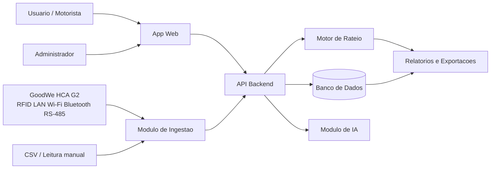

# Arquitetura da Solucao

## Visao geral

O EV ChargeOps pode ser implementado como uma aplicacao web com API central, banco relacional e modulo de integracao com carregadores. A primeira versao deve priorizar operacao manual ou semi-automatizada, porque isso reduz dependencia de hardware especifico e permite validar o modelo de rateio antes de integrar protocolos, APIs ou conectores proprietarios.

Para alinhar a arquitetura ao desafio GoodWe, a camada fisica de referencia da Sprint 01 e o carregador GoodWe HCA G2. A integracao real depende de acesso autorizado a documentacao, API, exportacao ou ambiente SEMS Portal/SEMS+, entao o MVP deve simular sessoes antes de conectar dados reais.

## Camada GoodWe considerada

| Item | Premissa para o projeto |
| --- | --- |
| Carregador | GoodWe HCA G2 como equipamento fisico de referencia. |
| Identificacao | RFID para associar uso a usuario, veiculo ou unidade. |
| Conectividade | LAN, Wi-Fi, Bluetooth e RS-485 como interfaces a avaliar. |
| Integracao | SEMS Portal/SEMS+ ou importacao simulada de sessoes na Sprint 01. |
| Protocolo local | RS-485/Modbus deve ser validado com documentacao oficial e acesso ao equipamento. |

## Componentes

| Componente | Responsabilidade |
| --- | --- |
| App web administrativo | Cadastro de locais, carregadores, usuarios, veiculos e regras de rateio. |
| API backend | Regras de negocio, autenticacao, calculos, relatorios e integracoes. |
| Banco de dados | Persistencia de sessoes, medidores, usuarios, tarifas, pagamentos e auditoria. |
| Modulo de ingestao | Recebe leituras manuais, importacoes CSV, exportacoes SEMS ou eventos de carregadores. |
| Motor de rateio | Calcula kWh, custo de energia, taxas e valor final por sessao. |
| Modulo de IA | Analise de consumo, previsao, anomalias e assistente operacional. |
| Relatorios | Exporta demonstrativos por periodo, unidade, usuario e carregador. |

## Fluxo principal

1. Administrador cadastra local, unidade consumidora e carregadores.
2. Administrador define tarifa, regra de rateio e taxa operacional.
3. Usuario inicia ou registra uma sessao de recarga.
4. Sistema recebe leitura inicial e final, ou dado equivalente do carregador.
5. Motor calcula kWh consumido e valor devido.
6. Relatorio consolida cobranca por usuario, unidade, veiculo e periodo.
7. IA pode sinalizar consumo fora do padrao ou demanda futura.

## Modelo de dados inicial

| Entidade | Campos principais |
| --- | --- |
| Local | id, nome, tipo, endereco, distribuidora, unidade_consumidora |
| Carregador | id, local_id, fabricante, modelo, codigo, potencia_kw, tipo_conector, conectividade, status |
| Usuario | id, nome, email, documento, unidade, perfil |
| Veiculo | id, usuario_id, placa, modelo, capacidade_bateria_kwh |
| SessaoRecarga | id, carregador_id, usuario_id, rfid_tag, inicio, fim, kwh, origem_dado, status |
| Tarifa | id, local_id, vigencia_inicio, vigencia_fim, valor_kwh, bandeira |
| Rateio | id, sessao_id, energia_rs, taxa_rs, desconto_rs, total_rs |
| Auditoria | id, entidade, entidade_id, acao, usuario_id, data_hora |

## Regras tecnicas

- Toda sessao deve ter identificador unico.
- Quando houver RFID, o identificador usado na sessao deve ser guardado ou mapeado com controle de privacidade.
- Todo calculo de rateio deve guardar a tarifa usada no momento do calculo.
- Alteracoes em tarifas e regras devem ser versionadas por vigencia.
- Relatorios financeiros devem ser reproduziveis mesmo quando uma regra futura mudar.
- A primeira versao deve aceitar importacao CSV para acelerar testes.

## Integracoes futuras

- OCPP para comunicacao com carregadores compativeis.
- GoodWe SEMS Portal/SEMS+, se houver API, exportacao ou acesso autorizado.
- Leitura local do GoodWe HCA G2 por RS-485/Modbus, se tecnicamente disponivel e documentada.
- Gateway de pagamento ou integracao com administradora condominial.
- API da distribuidora, quando houver disponibilidade e autorizacao.
- BI externo para dashboards executivos.

## Diagrama

## Decisoes pendentes

- Definir stack: Python/FastAPI, Node/NestJS ou outra.
- Definir banco: PostgreSQL recomendado para o MVP.
- Definir se havera app mobile ou apenas web responsivo.
- Definir se o MVP tera pagamento real ou apenas demonstrativo de cobranca.
- Definir padrao minimo de dados que cada carregador deve fornecer.
