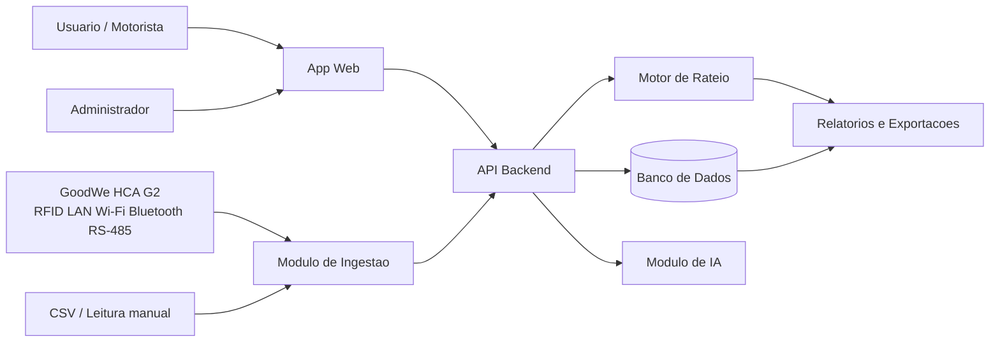

# Arquitetura da Solucao

## Visao geral

A arquitetura proposta para o EV ChargeOps e simples de proposito: app web, API backend, banco relacional, modulo de ingestao, motor de rateio, relatorios e uma camada de IA para apoio operacional.

Na Sprint 01, eu nao estou assumindo integracao real com carregador. O motivo e pratico: sem acesso ao equipamento GoodWe HCA G2, a uma conta SEMS+/SEMS Portal ou a uma API documentada para testes, qualquer integracao completa seria chute. Por isso a primeira versao deve aceitar CSV e dados simulados. Assim da para validar o fluxo de sessao e rateio antes de automatizar a coleta.

## Camada GoodWe considerada

| Item | Premissa para o projeto |
| --- | --- |
| Carregador | GoodWe HCA G2 como equipamento fisico de referencia do desafio. |
| Identificacao | RFID para relacionar sessao a usuario, veiculo ou unidade. |
| Conectividade | LAN, Wi-Fi, Bluetooth e RS-485 como interfaces citadas nos materiais publicos. |
| Integracao | SEMS+/SEMS Portal ou importacao simulada como caminho de evolucao. |
| Leitura local | RS-485/Modbus so deve ser usado se houver documentacao oficial e acesso ao equipamento. |

## Componentes

| Componente | Responsabilidade |
| --- | --- |
| App web administrativo | Cadastro de locais, carregadores, usuarios, veiculos e regras de rateio. |
| API backend | Regras de negocio, autenticacao, calculos, relatorios e integracoes. |
| Banco de dados | Guarda sessoes, usuarios, tarifas, calculos, origem dos dados e auditoria. |
| Modulo de ingestao | Recebe CSV, leitura manual, exportacao SEMS+ ou evento de carregador no futuro. |
| Motor de rateio | Calcula kWh, custo de energia, taxas e valor final por sessao. |
| Modulo de IA | Ajuda a detectar anomalias, resumir operacao e explicar cobrancas. |
| Relatorios | Gera demonstrativos por periodo, unidade, usuario e carregador. |

## Fluxo principal

1. Administrador cadastra o local, a unidade consumidora e os carregadores.
2. Administrador define tarifa, regra de rateio e taxa operacional.
3. Usuario inicia ou registra uma sessao de recarga.
4. Sistema recebe o dado da sessao por CSV, leitura manual ou integracao futura.
5. Motor de rateio calcula kWh consumido e valor devido.
6. Relatorio consolida a cobranca por usuario, unidade, veiculo e periodo.
7. IA pode apontar dados estranhos ou gerar uma explicacao do calculo.

## Modelo de dados inicial

| Entidade | Campos principais |
| --- | --- |
| Local | id, nome, tipo, endereco, distribuidora, unidade_consumidora |
| Carregador | id, local_id, fabricante, modelo, codigo, potencia_kw, tipo_conector, conectividade, status |
| Usuario | id, nome, email, documento, unidade, perfil |
| Veiculo | id, usuario_id, placa, modelo, capacidade_bateria_kwh |
| SessaoRecarga | id, carregador_id, usuario_id, rfid_tag, inicio, fim, kwh, origem_dado, status |
| Tarifa | id, local_id, vigencia_inicio, vigencia_fim, valor_kwh, bandeira |
| Rateio | id, sessao_id, energia_rs, taxa_rs, desconto_rs, total_rs |
| Auditoria | id, entidade, entidade_id, acao, usuario_id, data_hora |

## Regras tecnicas

- Toda sessao precisa ter identificador unico.
- Se houver RFID, o identificador deve ser guardado ou mapeado com cuidado, porque pode virar dado pessoal dependendo do uso.
- Todo calculo de rateio deve guardar a tarifa usada naquele momento.
- Alteracoes em tarifa e regra precisam ter vigencia, para nao quebrar relatorio antigo.
- Relatorio financeiro deve ser reproduzivel mesmo depois de uma regra mudar.
- A primeira versao deve aceitar importacao CSV para testar o modelo sem depender da integracao GoodWe.

## Integracoes futuras

- GoodWe SEMS+/SEMS Portal, se houver API, exportacao ou acesso autorizado.
- Leitura local do GoodWe HCA G2 por RS-485/Modbus, se for tecnicamente disponivel e documentada.
- OCPP para comunicacao com carregadores compativeis, caso o escopo evolua para outros fabricantes.
- Gateway de pagamento ou integracao com administradora condominial.
- API da distribuidora, se houver disponibilidade e autorizacao.
- BI externo para dashboards executivos.

## Diagrama

## Decisoes pendentes

- Escolher stack: Python/FastAPI, Node/NestJS ou outra.
- Confirmar banco de dados. PostgreSQL parece uma boa opcao para comecar, mas ainda precisa ser fechado.
- Definir se a primeira entrega sera uma interface web ou uma API documentada com dados de exemplo.
- Decidir se o MVP mostra apenas demonstrativo de cobranca ou se prepara caminho para pagamento real.
- Definir o formato minimo de sessao que sera aceito no CSV.
- Confirmar quais dados do GoodWe HCA G2 podem ser obtidos por SEMS+/SEMS Portal ou exportacao.
